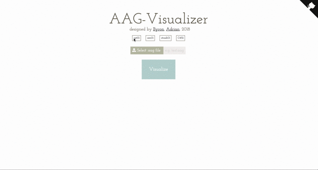
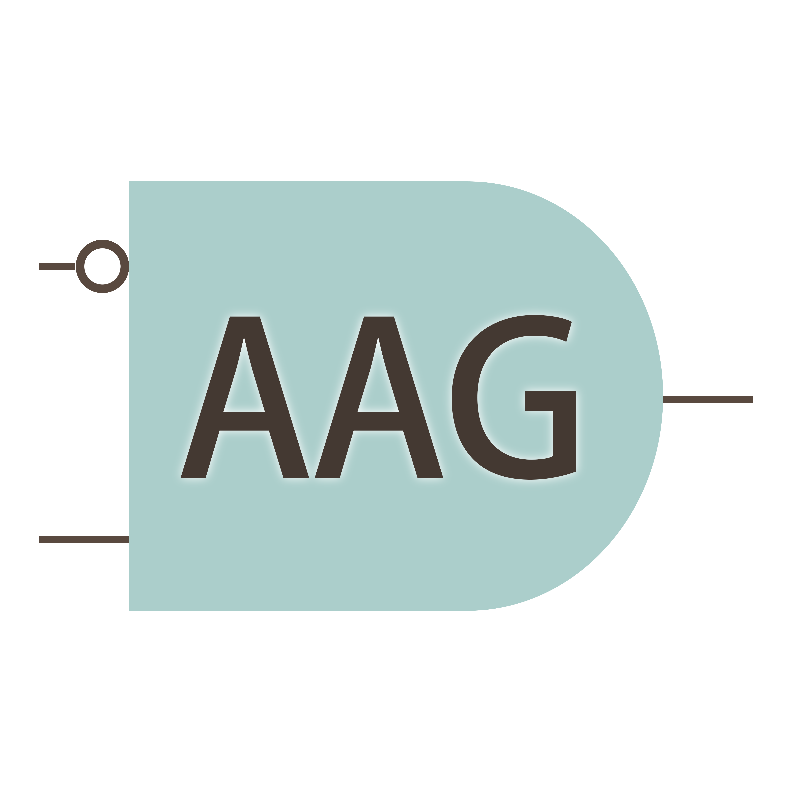

# AAG-Visualizer &middot; [](http://makeapullrequest.com)


> 🎉 ✨ An elegant Visualizer for visualizing aag file with [Viz.js](https://github.com/mdaines/viz.js)


## 0. Table of Contents  
- [Setup AAG-Visualizer](#1-setup-aag-visualizer)
- [Development and Production](#2-development-and-production)
- [Credits](#3-credits)
- [License](#4-license)
 
## 1. Setup AAG-Visualizer
```
git clone https://github.com/ByronHsu/AAG-Visualizer.git
npm install
```

## 2. Development and Production

### 2.1 To develop the project

```
npm run watch
npm run start
```

### 2.2 Build production bundle and run the server

```
npm run prod
npm start
```

## 3. Credits
- Fantastic graphviz library [viz.js](https://github.com/mdaines/viz.js)
- Best css animation library ever [animate.css](https://github.com/daneden/animate.css)

## 4. License
- [MIT](./LICENSE)
