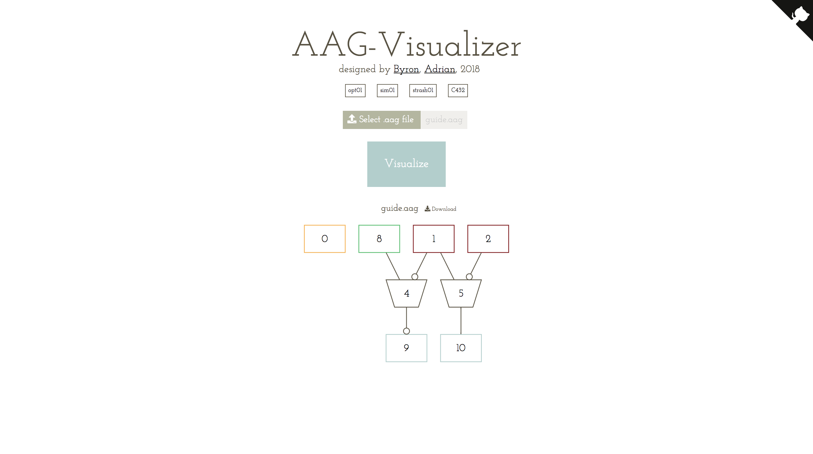

# aiger-format-guide

> Author: Hanmo Ou , Byron Hsu

### The format of an AAG file:

The file is used to describe a logical circuit.
Each gate is assigned a gate number, while gate number 0 is the constant 0 gate by default. (**The const 0 gate assigned number 0 without further declaration.**)

#### Take this aag for example

<p align="center"></img></p>
*orange: const, brown: input pins, blue: output pins, black: and gate, green: undef gate*

```
aag 8 2 0 2 2
2
4
9
10
8 3 16
10 5 2
c
generated by Byron Hsu
```


#### The first line is the header,
which contains information of the circuit, including number of each type of gates, and the maximum gate number.
The header is written in the below format :
``aag M I L O A``
While:
M is the maximum gate number (excluding outputs).
I is the number of input pins.
L is the number of latches (You can ignore it, because it will not show up in our file).
O is the number of output pins.
A is the number of AND gates.

#### The following lines are the input pins, which are listed by their literals:

Literals are used to declare whether the singal has been inverted.
For gate number N, its non-inverted literal is 2N, while its inverted literal is 2N+1.
Since input pins are never inverted, the literal is always even.
See the example above, the file list

```
2
4
```
as the input section.
So the input gate ids are 1(2/2), 2(4/2).
 
#### The output gates of the circuits is always numbered from M+1 to M+O, and in the file, the output gates are listed by their signal source literals, sorted by gate number.

See the example above, M=8, 

```
9
10
```

Output gate 9(M+1) has **inverted** 4(9/2) input, and output gate 10(M+2) has 5(10/2) input.

#### Following the above is the AIG sections, each line consists the gate literal, followed by their fanin literals.
See the example above, M=8, 

```
8 3 16
10 5 2
```

For the first line, it means that aig gate 4(8/2) has **inverted** 1(3/2) input and 8(16/2) input.
For the second line, it means that aig gate 5(10/2) has **inverted** 2(5/2) input and 1(2/2) input.

#### Last of all, the charactor after 'c' is just comments like '/' in c++, you can simply ignore it.
